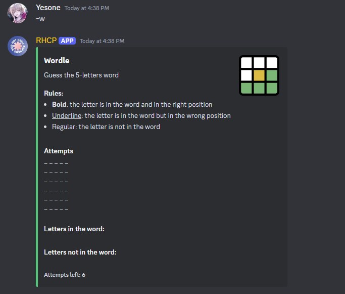
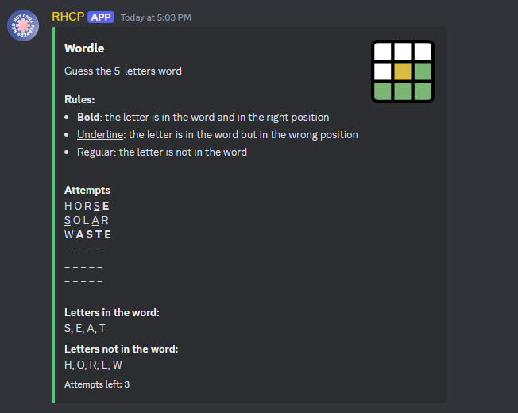
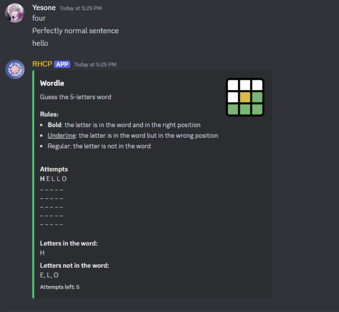
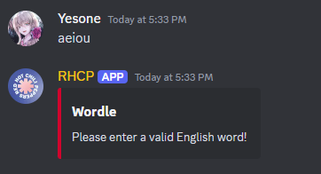
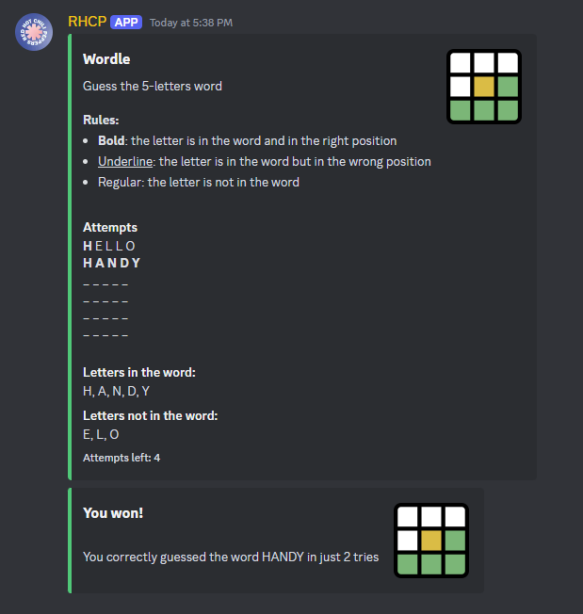
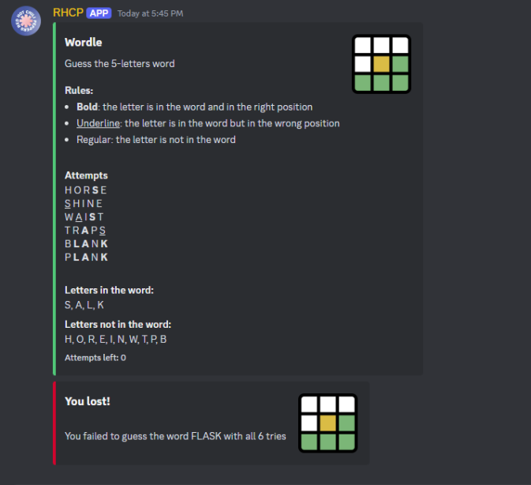

# WordleBot

Welcome to WordleBot! This bot brings the popular word-guessing game Wordle to your Discord server, allowing you and your community to enjoy challenging and engaging gameplay directly within Discord channels.

The rules are similar to the popular web version of the game, where you have 6 tries to guess a 5-letters word. In each try, you can guess using your own 5-letter English word and the game will tell you what letters are in the word, and if they are in the correct position or not (more on the rules down below).

Whether you're a Wordle enthusiast or new to the game, this bot aims to enhance your Discord server with fun and collaborative word-solving sessions. Get started by inviting the bot to your server and exploring its features!

## Gameplay Instructions

### Generation

Generate a Wordle instance by typing in a Discord channel: -wordle

Alternative, you can also use the more convenient version of the command: -w

### Rules

As stated above, you have 6 attempts to guess what the 5-letters word is. You have to use a valid 5-letters English word for each guess. The bot will then tell you how close your word is based on the text formatting style of each letters:

- Bold: the letter is in the word and in the right position. For example, if the word is HORSE and you guessed MOUSE. The bot will display M**O**U**SE**
- Underline: the letter is in the word but in the wrong position
- Regular: the letter is not in the word

The game will also contain a list of letters at the bottom of board to better keep track of which letter is in the word and which is not. Below is the game state for an instance where the word is TASTE

### Playing

After generating an instance, you can just enter any 5-letter word in the chat and bot will automatically update the board on how close your guess was.

The bot will only accept 5-letters word as a guess attempt, as demonstrated in the picture below:

Note: the guess has to be a valid English word, to avoid cheesing

### Win Condition

You'll win if you can guess the word within 6 attempts. Else, if you used up all 6 attempts but still didn't get the correct word, you'll lose.

Win board:

Lose board:

## Acknowledgements

External libraries: [dictionary-en](https://www.npmjs.com/package/dictionary-en), [nspell](https://www.npmjs.com/package/nspell)
